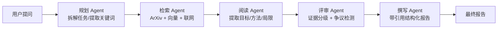

# 系统架构设计

## 一、总体架构（三层解耦）

```
┌─────────────────────────────────────────────────────────────┐
│  前端交互层（Next.js App Router / React 19）                  │
│  Sidebar · ChatPanel · ThinkingStream · KnowledgeGraph · Report│
└───────────────────────────┬─────────────────────────────────┘
                            │ SSE (text/event-stream)
┌───────────────────────────▼─────────────────────────────────┐
│  智能编排层（服务端 / 多 Agent）                              │
│  Orchestrator → Planner → Searcher → Reader → Critic → Writer │
└───────────────────────────┬─────────────────────────────────┘
                            │
┌───────────────────────────▼─────────────────────────────────┐
│  工具与数据层                                                 │
│  DeepSeek API · ArXiv API · 本地知识库(BM25) · pdfjs-dist     │
└─────────────────────────────────────────────────────────────┘
```

## 二、五阶段研究流水线



每个阶段通过 `AsyncGenerator` 实时产出 SSE 事件，前端即时更新「思考流」。

## 三、SSE 事件契约

后端 `POST /api/research` 返回 `text/event-stream`，事件类型（见 `src/lib/types.ts` 的 `ResearchEvent`）：

| 事件 | 含义 |
|---|---|
| `phase` | 当前所处阶段（用于顶栏提示） |
| `plan` | 规划出的研究步骤 |
| `step` | 某步骤 running / done |
| `papers` | 检索到的论文列表 |
| `scores` | 证据分级结果 |
| `controversy` | 检测到的学术争议点 |
| `graph` | 知识图谱节点与边 |
| `report_delta` | 报告流式增量 |
| `done` | 研究完成（含完整报告） |
| `error` | 错误信息 |

## 四、Mock / 真实模式切换

`src/lib/llm.ts` 暴露 `isConfigured()`，各 Agent 据此判断：

- **未配置 `DEEPSEEK_API_KEY`** → 走内置示例数据，保证 Demo 离线可跑
- **已配置** → 规划/撰写 Agent 调用 DeepSeek，检索 Agent 调用 ArXiv 真实 API

前端通过 `GET /api/health` 获知当前模式（不暴露密钥）。

## 五、扩展点（后续接入）

- **向量检索升级（ChromaDB）**：当前本地知识库为 BM25 关键词检索（见 `knowledge.ts`），可升级为 ChromaDB 向量检索以获得语义召回（CRAG 自我修正已实现，见 `retrieval.ts`）
- **PDF 全文解析**：在 `reader.ts` 中用 `pdf-parse` / PyMuPDF 替换摘要输入
- **MCP 工具调用**：为各 Agent 挂载 MCP 工具（浏览器、数据库等）
- **研究空白挖掘**（✅ 已实现）：见 `src/agents/gaps.ts`，已接入评审阶段
